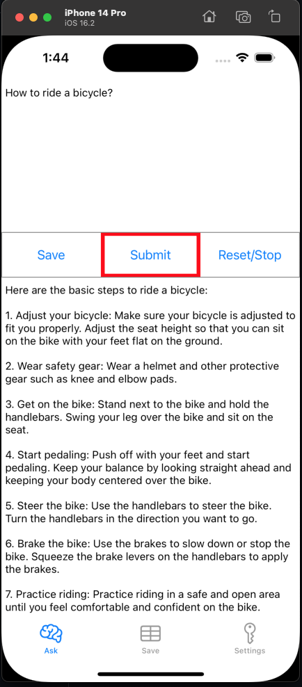

# chatgpt-ios
## A client for ChatGPT/GPT4. The app is being developed using ChatGPT/GPT-4.

### Prerequisites

Ensure that you have been invited to the API.
Add the text file API_Key.txt in the root folder with your API Key.

    
    

